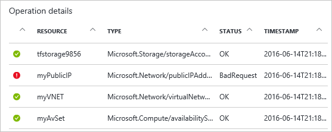
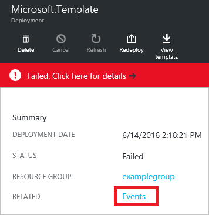
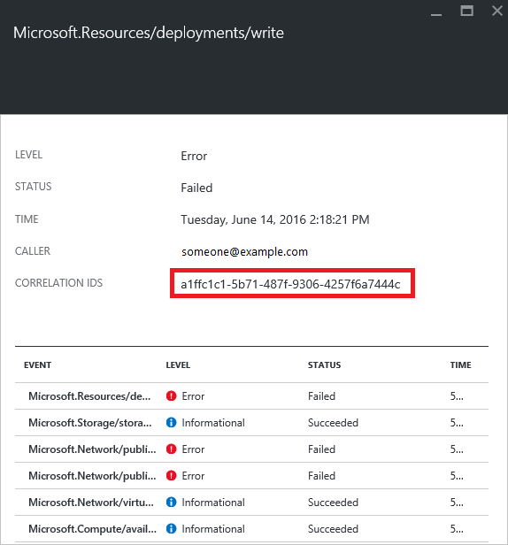

# 使用 Azure Resource Manager 查看部署操作

可以通过 Azure 门户预览查看部署操作。当你在部署过程中收到错误时，可能最想要查看操作，因此本文将重点介绍如何查看已失败的操作。该门户提供了一个界面让你轻松找到错误并确定可能的解决方法。

[!INCLUDE [resource-manager-troubleshoot-introduction](../../includes/resource-manager-troubleshoot-introduction.md)]

## 门户
若要查看部署操作，请使用以下步骤 ：

1. 对于部署中涉及的资源组，请注意最后一个部署的状态。你可以选择此状态以获取更多详细信息。

      

2. 你看到最近的部署历史记录。选择失败的部署。

      

3. 选择链接，查看部署失败的原因说明。在下图中，DNS 记录不是唯一的。

      

    此错误消息应足够让你可以开始进行故障排除。但是，如果你需要有关完成了哪些任务的更多详细信息，可以查看操作，如下面的步骤所示。
4. 可以在“部署”边栏选项卡中查看所有部署操作。选择任何操作，以查看更多详细信息。

      

    在此示例中，你会看到已成功创建存储帐户、虚拟网络和可用性集。公共 IP 地址失败，未尝试其他资源。
5. 可以通过选择“事件”查看部署的事件。

      

6. 查看部署的所有事件，并选择任何事件以了解更多详细信息。另请注意相关性 ID。与技术支持人员合作排查部署问题时，此值非常有用。

      

## PowerShell
1. 若要获取部署的总体状态，请使用 **Get-AzureRmResourceGroupDeployment** 命令。

      Get-AzureRmResourceGroupDeployment -ResourceGroupName ExampleGroup

也可以筛选结果，以便只获取失败的部署。

```powershell
  Get-AzureRmResourceGroupDeployment -ResourceGroupName ExampleGroup | Where-Object ProvisioningState -eq Failed
```

2. 每个部署包括多个操作。每个操作代表部署过程中的一个步骤。为了查明部署何处出现问题，通常需要查看部署操作的详细信息。可以用 **Get-AzureRmResourceGroupDeploymentOperation** 查看操作的状态。

      Get-AzureRmResourceGroupDeploymentOperation -ResourceGroupName ExampleGroup -DeploymentName vmDeployment

它将返回多个操作，其中每个操作采用以下格式：

```powershell
  Id             : /subscriptions/{guid}/resourceGroups/ExampleGroup/providers/Microsoft.Resources/deployments/Microsoft.Template/operations/A3EB2DA598E0A780
  OperationId    : A3EB2DA598E0A780
  Properties     : @{provisioningOperation=Create; provisioningState=Succeeded; timestamp=2016-06-14T21:55:15.0156208Z;
                   duration=PT23.0227078S; trackingId=11d376e8-5d6d-4da8-847e-6f23c6443fbf;
                   serviceRequestId=0196828d-8559-4bf6-b6b8-8b9057cb0e23; statusCode=OK; targetResource=}
  PropertiesText : {duration:PT23.0227078S, provisioningOperation:Create, provisioningState:Succeeded,
                   serviceRequestId:0196828d-8559-4bf6-b6b8-8b9057cb0e23...}
```

3. 若要获取有关失败操作的更多详细信息，请检索状态为“失败”的操作的属性。

      (Get-AzureRmResourceGroupDeploymentOperation -DeploymentName Microsoft.Template -ResourceGroupName ExampleGroup).Properties | Where-Object ProvisioningState -eq Failed

它将返回所有失败的操作，其中每个操作采用以下格式：

```powershell
  provisioningOperation : Create
  provisioningState     : Failed
  timestamp             : 2016-06-14T21:54:55.1468068Z
  duration              : PT3.1449887S
  trackingId            : f4ed72f8-4203-43dc-958a-15d041e8c233
  serviceRequestId      : a426f689-5d5a-448d-a2f0-9784d14c900a
  statusCode            : BadRequest
  statusMessage         : @{error=}
  targetResource        : @{id=/subscriptions/{guid}/resourceGroups/ExampleGroup/providers/
                          Microsoft.Network/publicIPAddresses/myPublicIP;
                          resourceType=Microsoft.Network/publicIPAddresses; resourceName=myPublicIP}
```

注意操作的 serviceRequestId 和 trackingId。与技术支持人员合作排查部署问题时，serviceRequestId 非常有用。将在下一步使用 trackingId 重点关注特定操作。
4. 若要获取特定失败操作的状态消息，请使用以下命令：

      ((Get-AzureRmResourceGroupDeploymentOperation -DeploymentName Microsoft.Template -ResourceGroupName ExampleGroup).Properties | Where-Object trackingId -eq f4ed72f8-4203-43dc-958a-15d041e8c233).StatusMessage.error

将返回：

```powershell
  code           message                                                                        details
  ----           -------                                                                        -------
  DnsRecordInUse DNS record dns.chinanorth.chinacloudapp.cn is already used by another public IP. {}
```

## Azure CLI

1. 使用 **azure group deployment show** 命令获取部署的总体状态。

      azure group deployment show --resource-group ExampleGroup --name ExampleDeployment --json

返回的值之一是 **correlationId**。此值可用于跟踪相关事件，在与技术支持人员合作排查部署问题时非常有用。

```azurecli
  "properties": {
    "provisioningState": "Failed",
    "correlationId": "4002062a-a506-4b5e-aaba-4147036b771a",
```

2. 若要查看部署操作，请使用：

      azure group deployment operation list --resource-group ExampleGroup --name ExampleDeployment --json

## REST

1. 使用[获取有关模板部署的信息](https://docs.microsoft.com/rest/api/resources/deployments#Deployments_Get)操作来获取有关部署的信息。

      GET https://management.chinacloudapi.cn/subscriptions/{subscription-id}/resourcegroups/{resource-group-name}/providers/microsoft.resources/deployments/{deployment-name}?api-version={api-version}

在响应中，请特别注意 **provisioningState**、**correlationId** 和 **error** 元素。**correlationId** 可用于跟踪相关事件，在与技术支持人员合作排查部署问题时非常有用。

```json
  { 
    ...
    "properties": {
      "provisioningState":"Failed",
      "correlationId":"d5062e45-6e9f-4fd3-a0a0-6b2c56b15757",
      ...
      "error":{
        "code":"DeploymentFailed","message":"At least one resource deployment operation failed. Please list deployment operations for details. Please see http://aka.ms/arm-debug for usage details.",
        "details":[{"code":"Conflict","message":"{\r\n  "error": {\r\n    "message": "Conflict",\r\n    "code": "Conflict"\r\n  }\r\n}"}]
      }  
    }
  }
```

2. 使用[列出所有模板部署操作](https://docs.microsoft.com/rest/api/resources/deployments#Deployments_List)操作来获取有关部署操作的信息。

      GET https://management.chinacloudapi.cn/subscriptions/{subscription-id}/resourcegroups/{resource-group-name}/providers/microsoft.resources/deployments/{deployment-name}/operations?$skiptoken={skiptoken}&api-version={api-version}

响应包含请求和/或响应信息，具体取决于部署期间在 **debugSetting** 属性中指定的内容。

```json
  {
    ...
    "properties": 
    {
      ...
      "request":{
        "content":{
          "location":"China North",
          "properties":{
            "accountType": "Standard_LRS"
          }
        }
      },
      "response":{
        "content":{
          "error":{
            "message":"Conflict","code":"Conflict"
          }
        }
      }
    }
  }
```

## 后续步骤
* 有关解决特定部署错误的帮助，请参阅 [Resolve common errors when deploying resources to Azure with Azure Resource Manager](./resource-manager-common-deployment-errors.md)（解决使用 Azure Resource Manager 将资源部署到 Azure 时的常见错误）。
* 若要了解如何使用活动日志监视其他类型的操作，请参阅[通过查看活动日志管理 Azure 资源](./resource-group-audit.md)。
* 若要在执行部署之前验证部署，请参阅[使用 Azure Resource Manager 模板部署资源组](./resource-group-template-deploy.md)。

<!---HONumber=Mooncake_0120_2017-->
<!-- Update_Description: new article how to deploy with Resource Manager in Azure. -->