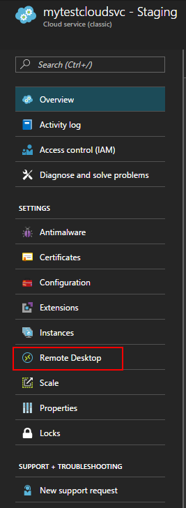
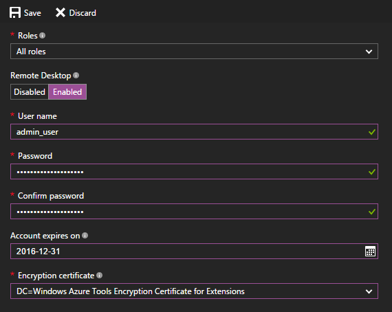
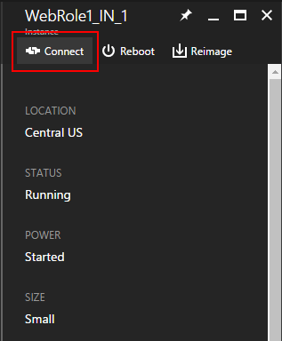

# 为 Azure 云服务中的角色设置远程桌面连接
>[!div class="op_single_selector"]
- [Azure 门户预览](./cloud-services-role-enable-remote-desktop-new-portal.md)
- [Azure 经典管理门户](./cloud-services-role-enable-remote-desktop.md)
- [PowerShell](./cloud-services-role-enable-remote-desktop-powershell.md)

你可以通过远程桌面访问在 Azure 中运行的角色的桌面。也可以使用远程桌面连接，在应用程序正在运行时排查和诊断其问题。

你可以在开发过程中通过在服务定义中加入远程桌面模块来在角色中启用远程桌面连接，也可以通过远程桌面扩展选择启用远程桌面。首选方法是使用远程桌面扩展，因为即使在部署应用程序后，也能启用远程桌面，而不必重新部署应用程序。

## 从 Azure 门户配置远程桌面
Azure 门户使用远程桌面扩展方法，即使在部署应用程序之后，也能启用远程桌面。使用云服务的“远程桌面”边栏选项卡，可以启用远程桌面、更改用于连接虚拟机的本地 Administrator 帐户、更改身份验证使用的证书，以及设置到期日期。

1. 依次单击“云服务”、云服务的名称，然后单击“远程桌面”。

      

2. 选择希望为单个角色还是所有角色启用远程桌面，然后将切换器的值更改为“已启用”。

3. 填写所需的字段：用户名、密码、到期时间和证书。

      

   > [!WARNING]
   首次启用远程桌面并单击“确定”（复选标记）时，所有角色实例会重新启动。为避免重新启动，必须在角色上安装用于对密码进行加密的证书。若要避免重新启动，请[上载云服务的证书](./cloud-services-configure-ssl-certificate.md#step-3-upload-a-certificate)，然后返回到此对话框。
   >
   >
3. 在“角色”中，选择要更新的角色，或选择“全部”以选择所有角色。

4. 完成配置更新后，单击“保存”。角色实例需要一些时间才能准备好接收连接。

## 远程到角色实例
对角色启用远程桌面后，可直接从 Azure 门户启动连接：

1. 单击“实例”打开“实例”边栏选项卡。
2. 选择一个已配置远程桌面的角色实例。
3. 单击“连接”下载角色实例的 RDP 文件。

      

4. 依次单击“打开”和“连接”以启动远程桌面连接。

## 后续步骤

[如何配置云服务](./cloud-services-how-to-configure.md)。

<!---HONumber=Mooncake_1226_2016-->