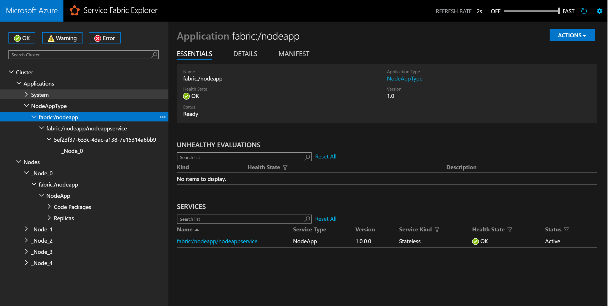
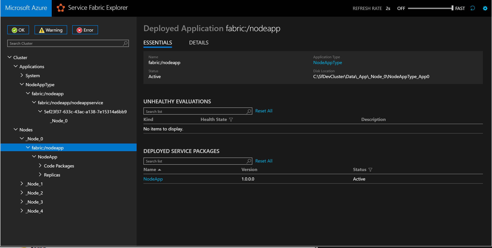

# 将来宾可执行文件部署到 Service Fabric
可以在 Azure Service Fabric 中运行任何类型的应用程序，如 Node.js、Java 或本机应用程序。Service Fabric 将这些类型的应用程序称为来宾可执行文件。来宾可执行文件由 Service Fabric 如同无状态服务一样进行处理。因此，可以出于可用性和其他指标目的将它们放置在群集中的节点上。本文介绍如何使用 Visual Studio 或命令行实用工具打包来宾可执行文件并将其部署到 Service Fabric 群集。

其中将会介绍打包来宾可执行文件并将它部署到 Service Fabric 的基本步骤。

## 在 Service Fabric 中运行来宾可执行文件的优势
在 Service Fabric 群集中运行来宾可执行文件有几个优势：

* 高可用性。Service Fabric 中运行的应用程序具有高可用性。Service Fabric 可确保应用程序的实例保持运行。
* 运行状况监视。Service Fabric 运行状况监视会检测应用程序是否正在运行，在发生故障时可提供诊断信息。
* 应用程序生命周期管理。除了提供无需停机的升级，如果升级期间报告了运行不正常事件，Service Fabric 还支持回滚到以前的版本。
* 密度。可以在群集中运行多个应用程序，这样便无需使每个应用程序在自己的硬件上运行。

## 示例
* [用于打包和部署来宾可执行文件的示例](https://github.com/Azure-Samples/service-fabric-dotnet-getting-started/tree/master/GuestExe/SimpleApplication)
* [使用 REST 通过命名服务通信的两个来宾可执行文件（C# 和 nodejs）的示例](https://github.com/Azure-Samples/service-fabric-dotnet-containers)

## 应用程序和服务清单文件概述
在部署来宾可执行文件的过程中，最好先了解[应用程序模型](./service-fabric-application-model.md)中所述的 Service Fabric 打包和部署模型。Service Fabric 打包模型依赖于两个 XML 文件：应用程序清单和服务清单。ApplicationManifest.xml 和 ServiceManifest.xml 文件的架构定义随 Service Fabric SDK 一起安装到 *C:\\Program Files\\Microsoft SDKs\\Service Fabric\\schemas\\ServiceFabricServiceModel.xsd* 中。

* **应用程序清单**
应用程序清单用于描述应用程序。它列出自身的构成服务，以及用于定义应如何部署一个或多个服务的其他参数（如实例数）。

  在 Service Fabric 中，应用程序是部署和升级的单位。可将应用程序作为一个单位进行升级，其中潜在的失败和潜在回滚受到管理。Service Fabric 保证升级过程成功，一旦升级失败，它不会使应用程序保持未知或不稳定状态。
* **服务清单**
服务清单描述服务的组件。其中包含服务的名称和类型、其代码以及配置等数据。服务清单还包含一些可以用于在部署之后配置服务的其他参数。

## 应用程序包文件结构
若要将应用程序部署到 Service Fabric，应用程序应遵循预定义的目录结构。下面是该结构的示例。

```
|-- ApplicationPackageRoot
    |-- GuestService1Pkg
        |-- Code
            |-- existingapp.exe
        |-- Config
            |-- Settings.xml
        |-- Data
        |-- ServiceManifest.xml
    |-- ApplicationManifest.xml
```

ApplicationPackageRoot 包含定义应用程序的 ApplicationManifest.xml 文件。应用程序中包含的每个服务的子目录用于包含该服务需要的所有项目。这些子目录为 servicemanifest.xml 以及以下内容（通常）：

* *Code*。此目录包含服务代码。
* *Config*。此目录包含一个 Settings.xml 文件（必要时还将包含其他文件），服务可以在运行时访问该文件以检索特定的配置设置。
* *Data*。这是用于存储服务可能需要的其他本地数据的其他目录。数据应仅用于存储临时数据。如果需要对服务进行重定位（例如在故障转移期间），则 Service Fabric 不会复制对数据目录所做的更改。

>[!NOTE]
> 如果不需要 `config` 和 `data` 目录，则不必创建它们。

## 打包现有的可执行文件
打包来宾可执行文件时，可以选择使用 Visual Studio 项目模板，或者[手动创建应用程序包](#manually)。使用 Visual Studio 时，新的项目模板将为用户创建应用程序包结构和清单文件。

>[!NOTE]
> 将现有 Windows 可执行文件打包到服务中的最简单方法是使用 Visual Studio。

##<a name="using-visual-studio-to-package-an-existing-application"></a><a name="using-visual-studio-to-package-an-existing-executable"></a><a name="use-visual-studio-to-package-an-existing-executable"></a> 使用 Visual Studio 打包现有的可执行文件

Visual Studio 提供 Service Fabric 服务模板来帮助你将来宾可执行文件部署到 Service Fabric 群集。

1. 选择“文件”>“新建项目”，然后创建一个 Service Fabric 应用程序。
2. 为服务模板选择“来宾可执行文件”。
3. 单击“浏览”选择包含所需可执行文件的文件夹，然后填充余下的参数来创建服务。
   * 代码包行为。可以设置为将文件夹中的所有内容复制到 Visual Studio 项目，如果可执行文件不会更改，则这种设置会很有用。如果预期可执行文件会更改，并且希望能够动态选择新版本，则可以改为选择文件夹的链接。请注意，在 Visual Studio 中创建应用程序项目时，可以使用链接的文件夹。这将会从项目内部链接到源位置，从而能够在来宾可执行文件的源目标中对它进行更新。这些更新会在生成时成为应用程序包的一部分。
   * *Program* 指定为了启动服务而应该运行的可执行文件。
   * *Arguments* 指定应传递给可执行文件的参数。它可以是带有实参的形参的列表。
   * *WorkingFolder* 指定要启动的进程的工作目录。可以指定三个值：
     * `CodeBase` 指定工作目录将设置为应用程序包中的 code 目录（前面文件结构中所示的 `Code` 目录）。
     * `CodePackage` 指定工作目录将设置为应用程序包中的根目录（前面文件结构中所示的 `GuestService1Pkg`）。
     * `Work` 指定将文件放置在名为 work 的子目录中。
4. 为服务命名，然后单击“确定”。
5. 如果服务需要使用终结点进行通信，现在可以在 ServiceManifest.xml 文件中添加协议、端口和类型。例如：`<Endpoint Name="NodeAppTypeEndpoint" Protocol="http" Port="3000" UriScheme="http" PathSuffix="myapp/" Type="Input" />`。
6. 接下来，可以通过在 Visual Studio 中调试解决方案，针对本地群集使用打包和发布操作。准备就绪后，可以将应用程序发布到远程群集，或者将解决方案签入源代码管理。
7. 请转到本文末尾，了解如何查看 Service Fabric Explorer 中运行的来宾可执行文件服务。

<a id="manually"></a>
## 手动打包和部署现有的可执行文件
手动打包来宾可执行文件的过程基于以下常规步骤：

1. 创建包目录结构。
2. 添加应用程序的代码和配置文件。
3. 编辑服务清单文件。
4. 编辑应用程序清单文件。

### 创建包目录结构
可首先创建目录结构，如前一节“应用程序包文件结构”中所述。

### 添加应用程序的代码和配置文件
创建了目录结构之后，可以在 code 和 config 目录下添加应用程序的代码和配置文件。还可以在 code 或 config 目录下创建其他目录或子目录。

Service Fabric 对应用程序根目录下的内容执行了 xcopy，因此除创建 code 和 settings 这两个顶级目录以外没有其他任何预定义结构可以使用。（如有需要可以选取其他名称。有关详细信息，请参阅下一节内容。）

>[!NOTE]
> 确保包含应用程序需要的所有文件和依赖项。Service Fabric 将复制群集中所有节点上的应用程序包的内容，将在群集中部署应用程序的服务。包中应该包含应用程序需要运行的所有代码。不要假定已安装依赖项。

### 编辑服务清单文件
下一步是编辑服务清单文件以包含如下信息：

* 服务类型的名称。这是 Service Fabric 用于标识服务的 ID。
* 用于启动应用程序的命令 (ExeHost)。
* 为设置应用程序而需要运行的任何脚本 (SetupEntrypoint)。

下面是 `ServiceManifest.xml` 文件的示例：

```xml
<?xml version="1.0" encoding="utf-8"?>
<ServiceManifest xmlns:xsd="http://www.w3.org/2001/XMLSchema" xmlns:xsi="http://www.w3.org/2001/XMLSchema-instance" Name="NodeApp" Version="1.0.0.0" xmlns="http://schemas.microsoft.com/2011/01/fabric">
   <ServiceTypes>
      <StatelessServiceType ServiceTypeName="NodeApp" UseImplicitHost="true"/>
   </ServiceTypes>
   <CodePackage Name="code" Version="1.0.0.0">
      <SetupEntryPoint>
         <ExeHost>
             <Program>scripts\launchConfig.cmd</Program>
         </ExeHost>
      </SetupEntryPoint>
      <EntryPoint>
         <ExeHost>
            <Program>node.exe</Program>
            <Arguments>bin/www</Arguments>
            <WorkingFolder>CodePackage</WorkingFolder>
         </ExeHost>
      </EntryPoint>
   </CodePackage>
   <Resources>
      <Endpoints>
         <Endpoint Name="NodeAppTypeEndpoint" Protocol="http" Port="3000" Type="Input" />
      </Endpoints>
   </Resources>
</ServiceManifest>
```

以下部分介绍了需要更新的文件的不同部分。

#### 更新 ServiceTypes

```xml
<ServiceTypes>
  <StatelessServiceType ServiceTypeName="NodeApp" UseImplicitHost="true" />
</ServiceTypes>
```

* 可为 `ServiceTypeName` 选择所需的任何名称。该值在 `ApplicationManifest.xml` 文件中用于标识服务。
* 指定 `UseImplicitHost="true"`。此属性告知 Service Fabric 服务基于自包含的应用，因此 Service Fabric 只需要将其作为进程启动并监视其运行状况。

#### 更新 CodePackage
CodePackage 元素指定服务代码的位置（和版本）。

```xml
<CodePackage Name="Code" Version="1.0.0.0">
```

`Name` 元素用于在应用程序包中指定包含服务代码的目录的名称。`CodePackage` 还具有 `version` 属性。这可以用于指定代码的版本，还可能用于通过使用 Service Fabric 中应用程序生命周期管理基础结构来升级服务的代码。

#### 可选：更新 SetupEntrypoint

```xml
<SetupEntryPoint>
   <ExeHost>
       <Program>scripts\launchConfig.cmd</Program>
   </ExeHost>
</SetupEntryPoint>
```

SetupEntryPoint 元素用于指定在启动服务代码之前应执行的任何可执行文件或批处理文件。这是一个可选步骤，因此在不需要初始化时无需包含在内。每次重新启动服务时，会执行 SetupEntryPoint。

只有一个 SetupEntryPoint，因此如果应用程序的设置需要多个脚本，则设置脚本需要组合在单个批处理文件中。SetupEntryPoint 可以执行任何类型的文件 - 可执行文件、批处理文件和 PowerShell cmdlet。有关更多详细信息，请参阅[配置 SetupEntryPoint](./service-fabric-application-runas-security.md)。

在上面的示例中，SetupEntrypoint 运行一个名为 `LaunchConfig.cmd` 的批处理文件，该文件位于 code 目录的 `scripts` 子目录中（假设 WorkingFolder 元素设置为 CodeBase）。

#### 更新 EntryPoint

```xml
<EntryPoint>
  <ExeHost>
    <Program>node.exe</Program>
    <Arguments>bin/www</Arguments>
    <WorkingFolder>CodeBase</WorkingFolder>
  </ExeHost>
</EntryPoint>
```

服务清单文件中的 `EntryPoint` 元素用于指定如何启动该服务。`ExeHost` 元素指定应用于启动该服务的可执行文件（和参数）。

* `Program` 指定应启动服务的可执行文件的名称。
* `Arguments` 指定应传递给可执行文件的参数。它可以是带有实参的形参的列表。
* `WorkingFolder` 指定要启动的进程的工作目录。可以指定三个值：
  * `CodeBase` 指定工作目录将设置为应用程序包中的 code 目录（前面所示文件结构中的 `Code` 目录）。
  * `CodePackage` 指定工作目录将设置为应用程序包中的根目录（前面所示文件结构中的 `GuestService1Pkg`）。
    * `Work` 指定将文件放置在名为 work 的子目录中。

WorkingFolder 用于设置正确的工作目录，以便应用程序或初始化脚本可以使用相对路径。

#### 更新终结点并在命名服务中注册以进行通信

```xml
<Endpoints>
       <Endpoint Name="NodeAppTypeEndpoint" Protocol="http" Port="3000" Type="Input" />
</Endpoints>
```

在前面的示例中，`Endpoint` 元素指定应用程序可以侦听的终结点。在此示例中，Node.js 应用程序侦听端口 3000 上的 http 流量。

此外，可以要求 Service Fabric 将此终结点发布到命名服务，使其他服务可以发现此服务的终结点地址。然后，便可以在服务（来宾可执行文件）之间进行通信。发布的终结点地址格式为 `UriScheme://IPAddressOrFQDN:Port/PathSuffix`。`UriScheme` 和 `PathSuffix` 是可选属性。`IPAddressOrFQDN` 是此可执行文件所在节点的 IP 地址或完全限定域名，系统会自动计算此值。

在以下示例中，部署服务后，Service Fabric Explorer 中会显示针对服务实例发布的终结点（类似于 `http://10.1.4.92:3000/myapp/`）。如果这是本地计算机，则显示 `http://localhost:3000/myapp/`。

```xml
<Endpoints>
   <Endpoint Name="NodeAppTypeEndpoint" Protocol="http" Port="3000"  UriScheme="http" PathSuffix="myapp/" Type="Input" />
</Endpoints>
```

可以配合[反向代理](./service-fabric-reverseproxy.md)使用这些地址在服务之间通信。

### 编辑应用程序清单文件
配置 `Servicemanifest.xml` 文件之后，需要对 `ApplicationManifest.xml` 文件进行一些更改，确保使用正确的服务类型和名称。

```xml
<?xml version="1.0" encoding="utf-8"?>
<ApplicationManifest xmlns:xsd="http://www.w3.org/2001/XMLSchema" xmlns:xsi="http://www.w3.org/2001/XMLSchema-instance" ApplicationTypeName="NodeAppType" ApplicationTypeVersion="1.0" xmlns="http://schemas.microsoft.com/2011/01/fabric">
   <ServiceManifestImport>
      <ServiceManifestRef ServiceManifestName="NodeApp" ServiceManifestVersion="1.0.0.0" />
   </ServiceManifestImport>
</ApplicationManifest>
```

#### ServiceManifestImport
在 `ServiceManifestImport` 元素中，可以指定要包含在应用中的一个或多个服务。`ServiceManifestName` 指定 `ServiceManifest.xml` 文件所在目录的名称，可用于引用服务。

```xml
<ServiceManifestImport>
  <ServiceManifestRef ServiceManifestName="NodeApp" ServiceManifestVersion="1.0.0.0" />
</ServiceManifestImport>
```

## 设置日志记录
对于来宾可执行文件，最好能够查看控制台日志，以查明应用程序和配置脚本是否显示了任何错误。可以使用 `ConsoleRedirection` 元素在 `ServiceManifest.xml` 文件中配置控制台重定向。

```xml
<EntryPoint>
  <ExeHost>
    <Program>node.exe</Program>
    <Arguments>bin/www</Arguments>
    <WorkingFolder>CodeBase</WorkingFolder>
    <ConsoleRedirection FileRetentionCount="5" FileMaxSizeInKb="2048"/>
  </ExeHost>
</EntryPoint>
```

`ConsoleRedirection` 可用于将控制台输出（stdout 和 stderr）重定向到工作目录。这可验证在 Service Fabric 群集中设置或执行应用程序时没有出现错误。

`FileRetentionCount` 确定保存在工作目录中的文件的数量。例如，值 5 表示前 5 个执行的日志文件存储在工作目录中。

`FileMaxSizeInKb` 指定日志文件的最大大小。

日志文件保存在服务的一个工作目录中。若要确定文件所在的位置，请使用 Service Fabric Explorer 来确定运行服务的节点以及所使用的工作目录。本文中后面部分介绍了此过程。

## 部署
最后一步是部署应用程序。以下 PowerShell 脚本演示如何将应用程序部署到本地开发群集并启动新的 Service Fabric 服务。

```PowerShell
Connect-ServiceFabricCluster localhost:19000

Write-Host 'Copying application package...'
Copy-ServiceFabricApplicationPackage -ApplicationPackagePath 'C:\Dev\MultipleApplications' -ImageStoreConnectionString 'file:C:\SfDevCluster\Data\ImageStoreShare' -ApplicationPackagePathInImageStore 'nodeapp'

Write-Host 'Registering application type...'
Register-ServiceFabricApplicationType -ApplicationPathInImageStore 'nodeapp'

New-ServiceFabricApplication -ApplicationName 'fabric:/nodeapp' -ApplicationTypeName 'NodeAppType' -ApplicationTypeVersion 1.0

New-ServiceFabricService -ApplicationName 'fabric:/nodeapp' -ServiceName 'fabric:/nodeapp/nodeappservice' -ServiceTypeName 'NodeApp' -Stateless -PartitionSchemeSingleton -InstanceCount 1
```

Service Fabric 服务可以采用各种“配置”进行部署。 例如，可以将其作为单个或多个实例部署，或者可以将其以这样一种方式部署：在 Service Fabric 群集的每个节点上都有一个服务实例。

`New-ServiceFabricService` cmdlet 的 `InstanceCount` 参数用于指定应在 Service Fabric 群集中启动的服务实例的数量。可以根据要部署的应用程序类型设置 `InstanceCount` 值。最常见的两种方案是：

* `InstanceCount = "1"`。在此情况下，只会在群集中部署一个服务实例。Service Fabric 的计划程序确定将在哪一个节点上部署服务。
* `InstanceCount ="-1"`。在此情况下，将在 Service Fabric 群集中的每个节点上部署一个服务实例。结果是群集中的每个节点上都有一个（且只有一个）服务实例。

这是前端应用程序（不包括 REST 终结点）的有用配置，因为客户端应用程序需要“连接到”群集中的任何节点才能使用该终结点。例如，当 Service Fabric 群集的所有节点都连接到负载均衡器时，也可以使用此配置。然后，客户端流量可以分布于在集群中所有节点上运行的服务。

## 检查正在运行的应用程序
在 Service Fabric Explorer 中，确定服务在其中运行的节点。在此示例中，它在节点 1 上运行：

  

导航到该节点并浏览到应用程序后，将会看到基本节点信息（包括在它磁盘上的位置）。

  

如果使用服务器资源管理器浏览到目录，可找到工作目录和服务的日志文件夹，如以下屏幕截图所示。

  

## 后续步骤
在本文中，我们了解了如何打包来宾可执行文件并将它部署到 Service Fabric。有关相关信息和任务，请参阅以下文章。

- [在 GitHub 上打包和部署来宾可执行文件的示例](https://github.com/Azure-Samples/service-fabric-dotnet-getting-started/tree/master/GuestExe/SimpleApplication)，包括打包工具的预发行版本的链接
- [使用 REST 通过命名服务通信的两个来宾可执行文件（C# 和 nodejs）的示例](https://github.com/Azure-Samples/service-fabric-dotnet-containers)
- [部署多个来宾可执行文件](./service-fabric-deploy-multiple-apps.md)
- [使用 Visual Studio 创建第一个 Service Fabric 应用程序](./service-fabric-create-your-first-application-in-visual-studio.md)

<!---HONumber=Mooncake_0227_2017-->
<!--Update_Description: wording update-->