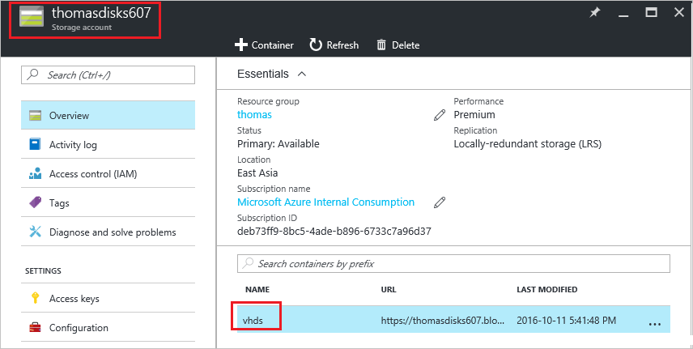
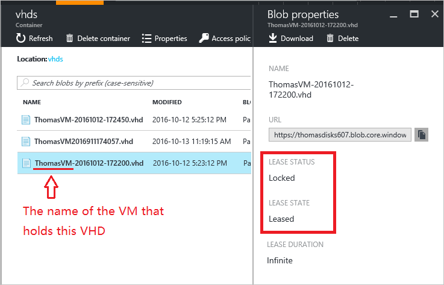

# 删除 Resource Manager 部署中的 Azure 存储帐户、容器或 VHD 时对错误进行故障排除

尝试在 [Azure 门户预览](https://portal.azure.cn)中删除 Azure 存储帐户、容器或虚拟硬盘 (VHD) 时，可能会收到错误。本文提供故障排除指导，帮助解决 Azure Resource Manager 部署中的问题。

## 症状

### 方案 1

尝试删除 Resource Manager 部署中存储帐户的 VHD 时，会收到以下错误消息：

**无法删除 Blob“vhds/BlobName.vhd”。错误：目前 Blob 上有租约，但请求中未指定任何租约 ID。**

如果虚拟机 (VM) 在尝试删除的 VHD 上有租约，会出现此问题。

### 方案 2

尝试删除 Resource Manager 部署中存储帐户的容器时，会收到以下错误消息：

**无法删除存储容器“vhds”。错误：目前容器上有租约，但请求中未指定任何租约 ID。**

如果容器包含租约状态为“已锁定”的 VHD，会出现此问题。

### 方案 3

尝试删除 Resource Manager 部署中的存储帐户时，会收到以下错误消息：

**无法删除存储帐户“StorageAccountName”。错误：正在使用存储帐户的项目，因此无法删除该存储帐户。**

如果存储帐户包含处于租赁状态的 VHD，会出现此问题。

## 解决方案
若要解决这些问题，必须识别导致错误的 VHD 和关联的 VM。然后，从 VM 分离该 VHD（适用于数据磁盘），或删除正在使用该 VHD 的 VM（适用于 OS 磁盘）。这会从 VHD 中删除租约，因此能够删除该 VHD。

### 步骤 1：识别有问题的 VHD 和关联的 VM

1. 登录到 [Azure 门户预览](https://portal.azure.cn)。
2. 在“中心”菜单上，选择“所有资源”。转到想要删除的存储帐户，然后选择“Blob”>“VHD”。

      

3. 检查容器中每个 VHD 的属性。找到处于“已租用”状态的 VHD。然后，确定正在使用该 VHD 的 VM。通常情况下，可通过检查 VHD 的名称确定保存该 VHD 的 VM：

   * OS 磁盘通常遵循以下命名约定：VMNameYYYYMMDDHHMMSS.vhd
   * 数据磁盘通常遵循以下命名约定：VMName-YYYYMMDD-HHMMSS.vhd

       

### 步骤 2：从 VHD 中删除租约

删除正在使用 VHD 的 VM（适用于 OS 磁盘）：

1. 登录到 [Azure 门户预览](https://portal.azure.cn)。
2. 在“中心”菜单上，选择“虚拟机”。
3. 选择在 VHD 上保存租约的 VM。
4. 确保没有任何组件正在使用该虚拟机，并确认你不再需要该虚拟机。
5. 在“VM 详细信息”边栏选项卡顶部，选择“删除”，然后单击“是”确认。
6. VM 应该已删除，但 VHD 应该保留下来。但是，VHD 上不应该再有租约。可能需要几分钟才能释放租约。若要确认释放了租约，请转到“所有资源”>“存储帐户名称”>“Blob”>“VHD”。在“Blob 属性”窗格中，“租约状态”值应为“已解锁”。

从正在使用 VHD 的 VM 分离它（适用于数据磁盘）：

1. 登录到 [Azure 门户预览](https://portal.azure.cn)。
2. 在“中心”菜单上，选择“虚拟机”。
3. 选择在 VHD 上保存租约的 VM。
4. 选择“VM 详细信息”边栏选项卡中的“磁盘”。
5. 选择在 VHD 上保存租约的数据磁盘。可通过检查 VHD 的 URL 确定附加在磁盘中的 VHD。
6. 确保没有任何对象正在主动使用该数据磁盘。
7. 单击“磁盘详细信息”边栏选项卡中的“分离”。
8. 磁盘现在应该已从 VM 分离，且 VHD 上不应该再有租约。可能需要几分钟才能释放租约。若要确认已释放租约，请转到“所有资源”>“存储帐户名称”>“Blob”>“VHD”。在“Blob 属性”窗格中，“租约状态”值应为“已解锁”。

## 租约是什么？

租约是可用于控制对 Blob（例如，VHD）的访问的锁。租用 Blob 时，仅租约的所有者才能访问该 Blob。租约非常重要，原因如下：

- 如果多个所有者尝试同时写入 Blob 的相同部分，它可防止数据损坏。

- 如果某个对象正在主动使用 Blob（例如，VM），它可防止删除该 Blob。

- 如果某个对象正在主动使用存储帐户（例如，VM），它可防止删除该存储帐户。

## 后续步骤

- [删除存储帐户](./storage-create-storage-account.md#delete-a-storage-account)
- [如何在 Azure 中解除 Blob 存储的锁定租约 (PowerShell)](https://gallery.technet.microsoft.com/scriptcenter/How-to-break-the-locked-c2cd6492)

<!---HONumber=Mooncake_0313_2017-->